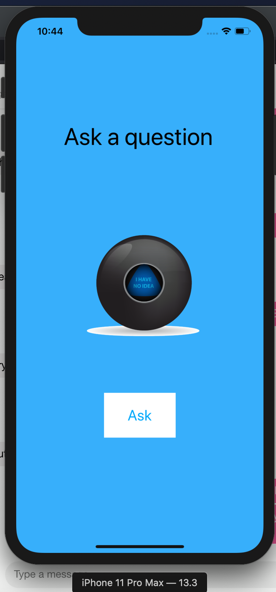
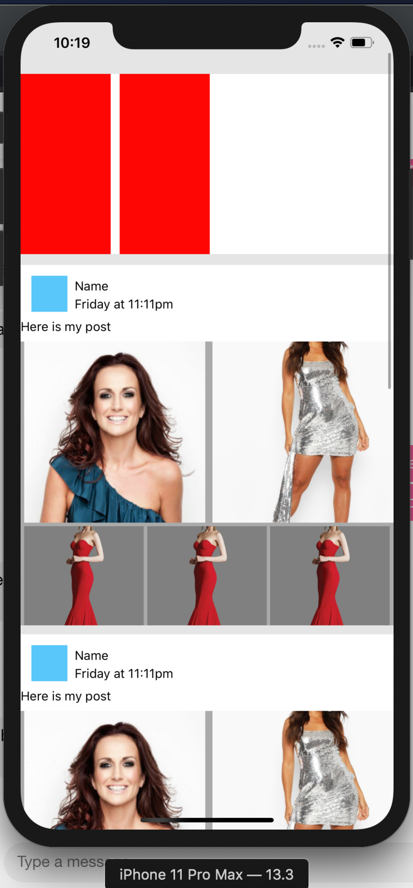
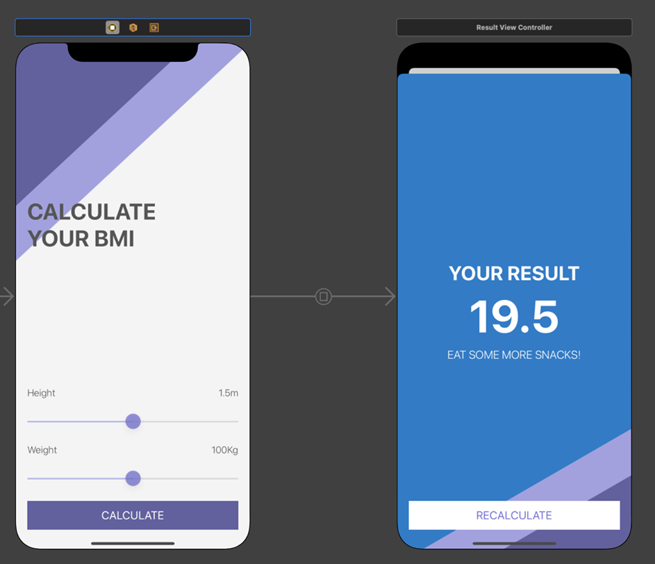
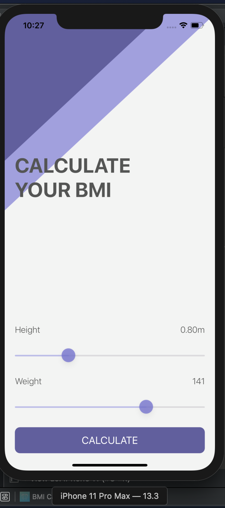
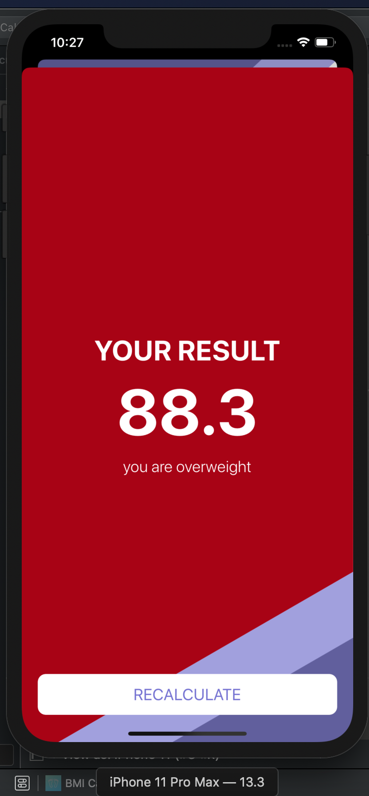
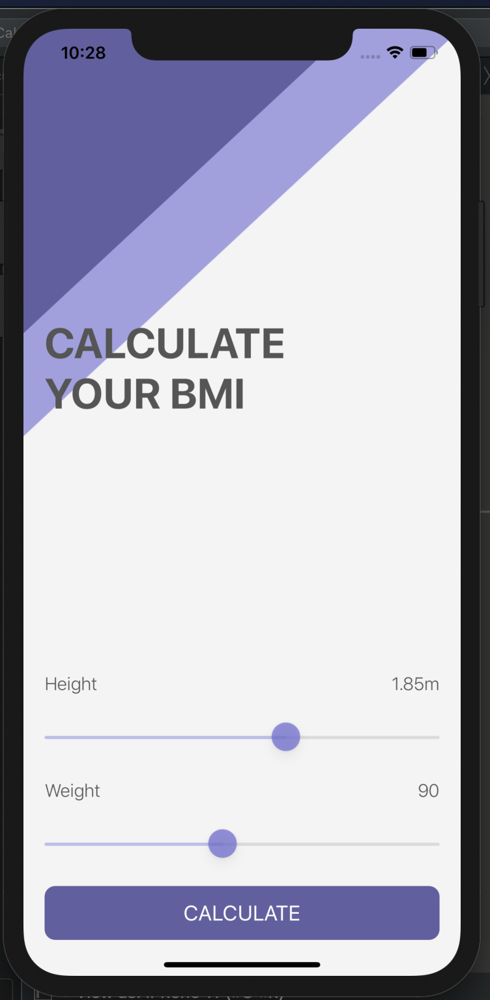
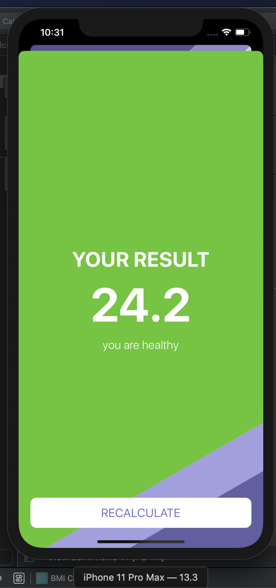
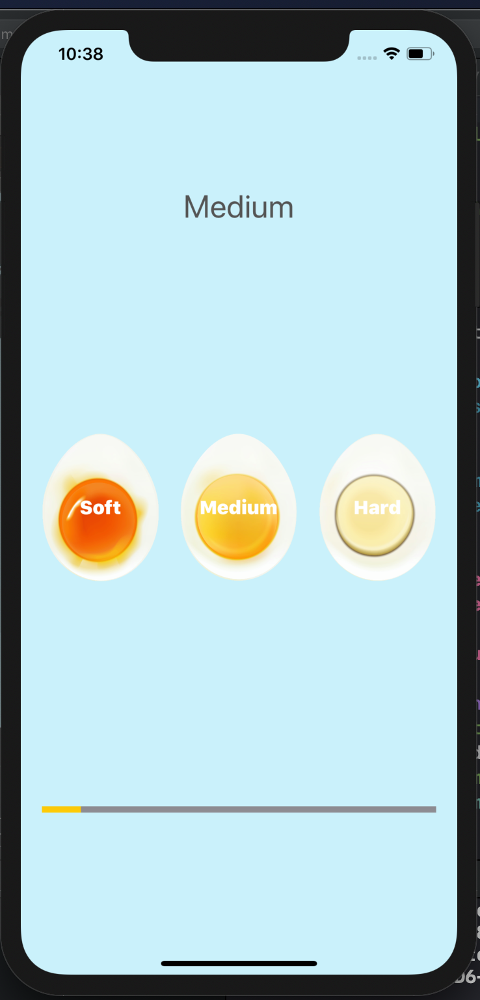
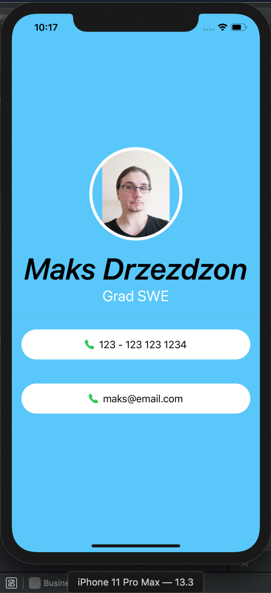
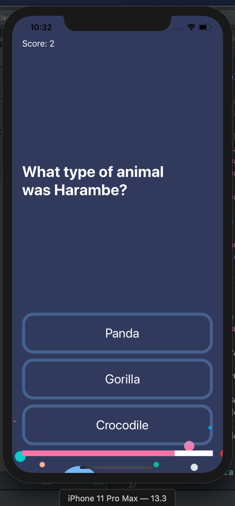

im going to be working on this repo more in the future when i get a macbook for IOS development in the next few weeks
'got my degree and macbook woop time for more work'

-------------------------------------------------------
USEFUL LINKS

-Color templates
https://flatuicolors.com/palette/defo
https://www.uicolor.xyz/#/hex-to-ui

-Screen p-sizes for Iphones
https://www.paintcodeapp.com/news/ultimate-guide-to-iphone-resolutions

-online image generator
https://appicon.co/#image-sets

-create basic assets
https://www.canva.com/

-ios design guidelines
https://developer.apple.com/design/human-interface-guidelines/ios/overview/themes/

-mobile design cheat sheet
https://material.io/design/environment/surfaces.html#properties

-apple docs
https://developer.apple.com/documentation/

-apple sf symbols free assets/icons
https://developer.apple.com/design/human-interface-guidelines/sf-symbols/overview/

---App demos---

 
<h><b>Forecast app</b></h>

pull data from api, present it, change icons to represent forecast

 

 
<h>Facebook layout app (needs more work)</h>

making layouts with external libiraries

 

 
<h>BMI calc</h>

multi view app, change color and give user feedback

 

  

    
  

  

     
  

  

      

 
<h>Egg timer app</h>

 

 
<h>Roll dice app</h>

basic functions, buttons, views, building reusable SwiftUI components

 

 
<h>Business card layout</h>

layout app

 

 
<h>8 Ball app</h>

basic functions, buttons, views

 

 
<h>quiz app</h>

Dynamic progress bar

 

