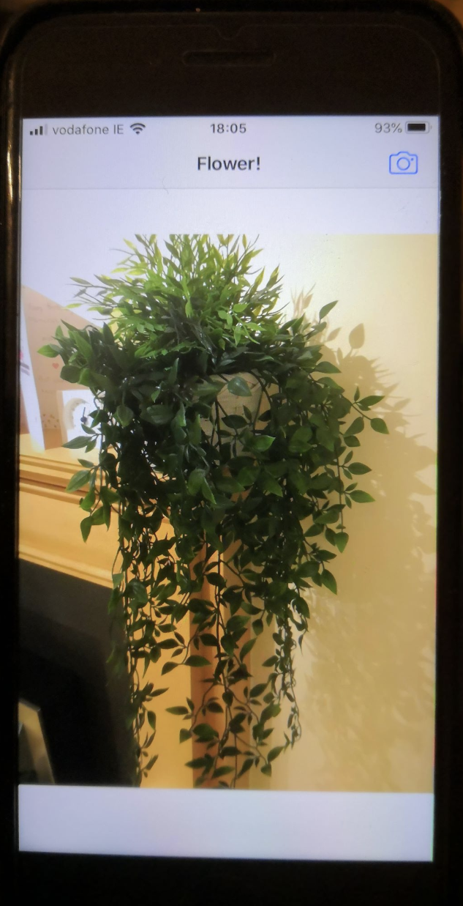
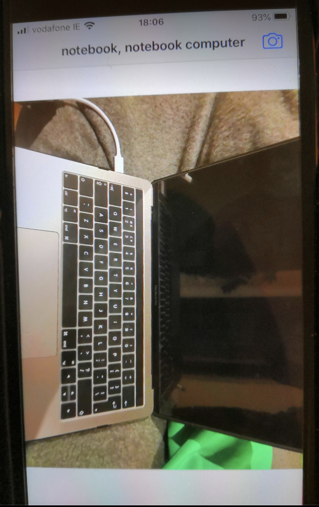
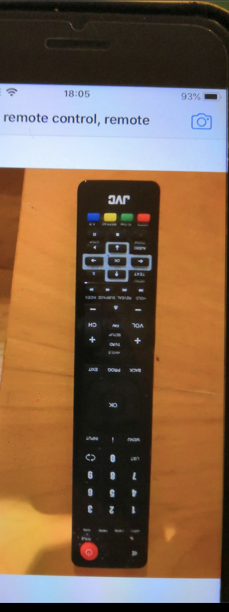
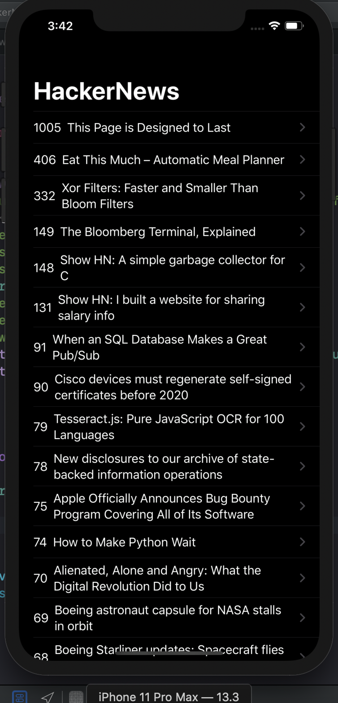
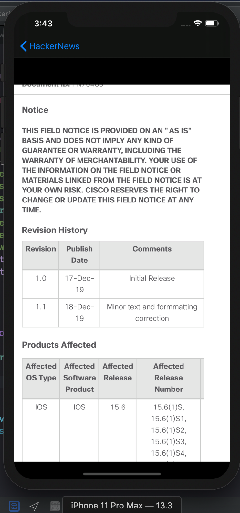
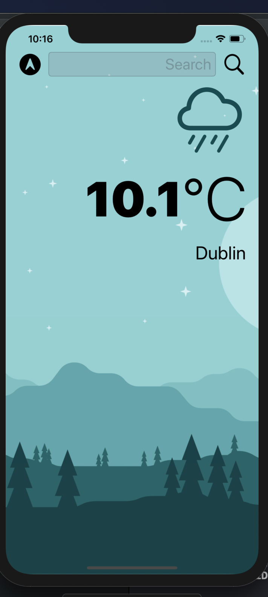
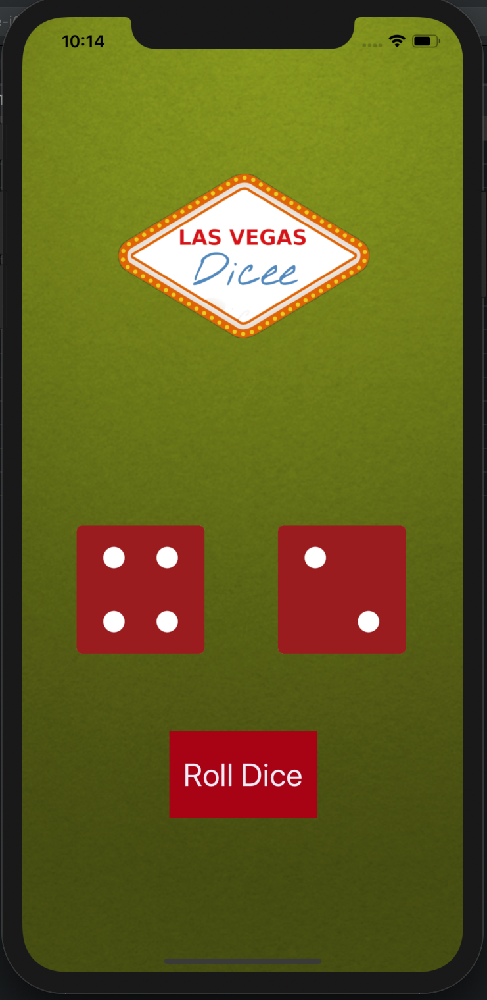

im going to be working on this repo more in the future when i get a macbook for IOS development in the next few weeks
'got my degree and macbook woop time for more work'

-------------------------------------------------------
USEFUL LINKS

-Color templates
https://flatuicolors.com/palette/defo
https://www.uicolor.xyz/#/hex-to-ui

-Screen p-sizes for Iphones
https://www.paintcodeapp.com/news/ultimate-guide-to-iphone-resolutions

-online image generator
https://appicon.co/#image-sets

-create basic assets
https://www.canva.com/

-ios design guidelines
https://developer.apple.com/design/human-interface-guidelines/ios/overview/themes/

-mobile design cheat sheet
https://material.io/design/environment/surfaces.html#properties

-apple docs
https://developer.apple.com/documentation/

-indicators in xcode
https://stackoverflow.com/questions/6662395/xcode-intellisense-meaning-of-letters-in-colored-boxes-like-f-t-c-m-p-c-k-etc

-apple sf symbols free assets/icons
https://developer.apple.com/design/human-interface-guidelines/sf-symbols/overview/

---App demos---

 
<h><b>Facebook layout app</b>(needs more work)</h>

making layouts with external libiraries

 

 
<h><b>Image Recognition App</b></h>

building off concepts learned in college with python and intergrating with IOS app

 

  

    
    
i overrode the text in this case because its a personal inside joke

  

  

      
  

<!--
 
<h><b>ToDo app</b></h>

using SwiftUI, and list layouts along with color templates to design a colorful yet to use simple UI

 

  

    
  

  

     
  

  

      
  

-->
 
<h><b>BMI calc</b></h>

multi view app, change color and give user feedback

 

  

    
  

  

     
  

  

      
  

 
<h><b>HackerNews Demo app</b></h>

multi view app, parse data and provide navigation, use webview to open web links

 

  

     
  

 
<h><b>Forecast app</b></h>

pull data from api, present it, change icons to represent forecast

 

 
<h><b>quiz app</b></h>

Dynamic progress bar

 

 
<h><b>Business card layout</b></h>

layout app

 

 
<h><b>Egg timer app</b></h>

 

 
<h><b>Roll dice app</b></h>

basic functions, buttons, views, building reusable SwiftUI components

 

 
<h><b>8 Ball app</b></h>

basic functions, buttons, views

 

